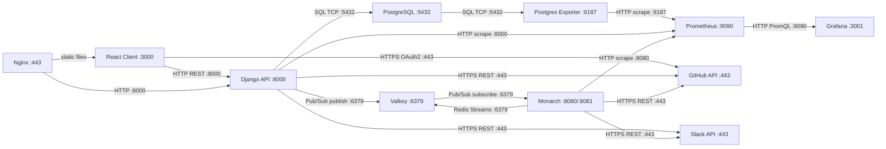
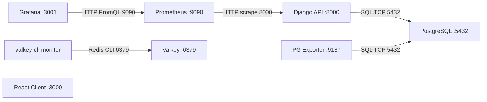
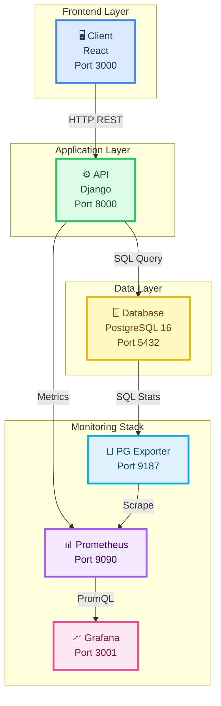

# System Map (AI)

## 1. System Diagram v1

```mermaid
graph LR
    Client["React Client :3000"]
    API["Django API :8000"]
    PG["PostgreSQL :5432"]
    Valkey["Valkey :6379"]
    Monarch["Monarch :8080/:8081"]
    Prometheus["Prometheus :9090"]
    PGExp["Postgres Exporter :9187"]
    Grafana["Grafana :3001"]
    Nginx["Nginx :443"]
    GitHub["GitHub API :443"]
    Slack["Slack API :443"]

    Client -->|"HTTP REST :8000"| API
    Client -->|"HTTPS OAuth2 :443"| GitHub
    API -->|"SQL TCP :5432"| PG
    API -->|"HTTPS REST :443"| GitHub
    API -->|"HTTPS REST :443"| Slack
    API -->|"Pub/Sub publish :6379"| Valkey
    Valkey -->|"Pub/Sub subscribe :6379"| Monarch
    Monarch -->|"HTTPS REST :443"| GitHub
    Monarch -->|"HTTPS REST :443"| Slack
    Monarch -->|"Redis Streams :6379"| Valkey
    PG -->|"SQL TCP :5432"| PGExp
    PGExp -->|"HTTP scrape :9187"| Prometheus
    API -->|"HTTP scrape :8000"| Prometheus
    Monarch -->|"HTTP scrape :8080"| Prometheus
    Prometheus -->|"HTTP PromQL :9090"| Grafana
    Nginx -->|"HTTP :8000"| API
    Nginx -->|"static files"| Client
```

## 1. System Diagram v2

```mermaid
graph LR
    api[Django API :8000]
    database[PostgreSQL :5432]
    prometheus[Prometheus :9090]
    grafana[Grafana :3001]
    postgres_exporter[PG Exporter :9187]
    valkey[Valkey :6379]
    valkey_monitor[valkey-cli monitor]
    client[React Client :3000]

    api -->|SQL TCP 5432| database
    postgres_exporter -->|SQL TCP 5432| database
    prometheus -->|HTTP scrape 8000| api
    grafana -->|HTTP PromQL 9090| prometheus
    valkey_monitor -->|Redis CLI 6379| valkey
```

##
# System Map (AI)

## System Diagram Mermaid style

```mermaid
graph TB
    subgraph Frontend["Frontend Layer"]
        direction LR
        CLIENT["🖥️ Client<br/>React<br/>Port 3000"]
    end

    subgraph Application["Application Layer"]
        direction LR
        API["⚙️ API<br/>Django<br/>Port 8000"]
    end

    subgraph Data["Data Layer"]
        direction LR
        DB["🗄️ Database<br/>PostgreSQL 16<br/>Port 5432"]
    end

    subgraph Monitoring["Monitoring Stack"]
        direction LR
        PROM["📊 Prometheus<br/>Port 9090"]
        GRAF["📈 Grafana<br/>Port 3001"]
        PGEXP["🔌 PG Exporter<br/>Port 9187"]
    end

    CLIENT -->|HTTP REST| API
    API -->|SQL Query| DB
    API -->|Metrics| PROM
    DB -->|SQL Stats| PGEXP
    PGEXP -->|Scrape| PROM
    PROM -->|PromQL| GRAF

    style CLIENT fill:#dbeafe,stroke:#3b82f6,stroke-width:3px,color:#1e3a5f
    style API fill:#dcfce7,stroke:#22c55e,stroke-width:3px,color:#14532d
    style DB fill:#fef9c3,stroke:#eab308,stroke-width:3px,color:#713f12
    style PROM fill:#f3e8ff,stroke:#a855f7,stroke-width:3px,color:#3b0764
    style GRAF fill:#fce7f3,stroke:#ec4899,stroke-width:3px,color:#831843
    style PGEXP fill:#e0f2fe,stroke:#0ea5e9,stroke-width:3px,color:#0c4a6e
```