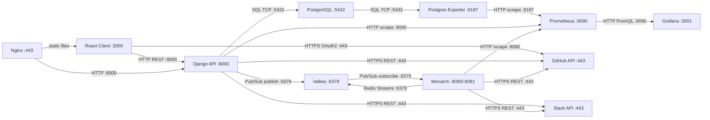
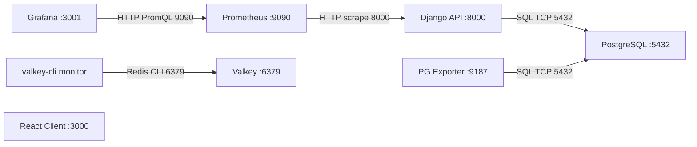

# System Map (AI)

## 1. System Diagram v1


## 1. System Diagram v2



##
```mermaid
graph TB
    subgraph Frontend["Frontend Layer"]
        direction LR
        client["🖥️ Client<br/>React<br/>:3000"]
    end

    subgraph Application["Application Layer"]
        direction LR
        api["⚙️ API<br/>Django<br/>:8000"]
    end

    subgraph Data["Data Layer"]
        direction LR
        database["🗄️ Database<br/>PostgreSQL 16<br/>:5432"]
        valkey["💾 Valkey<br/>Valkey<br/>:6379"]
    end

    subgraph Monitoring["Monitoring Stack"]
        direction LR
        prometheus["📊 Prometheus<br/>Prometheus<br/>:9090"]
        grafana["📈 Grafana<br/>Grafana<br/>:3001"]
        pg_exporter["🔌 PG Exporter<br/>postgres-exporter<br/>:9187"]
        valkey_monitor["👁️ Valkey Monitor<br/>valkey-cli<br/>monitor"]
    end

    api -->|SQL Query| database
    pg_exporter -->|SQL Query| database
    prometheus -->|Metri
    grafana -->|PromQL Query| prometheus
    valkey_monitor -->|Redis CLI| valkey

    style client fill:#dbeafe,stroke:#3b82f6,stroke-width:3px,color:#1e3a5f
    style api fill:#dcfce7,stroke:#22c55e,stroke-width:3px,color:#14532d
    style database fill:-width:3px,color:#713f12
    style valkey fill:#fef9c3,stroke:#eab308,stroke-width:3px,color:#713f12
    style prometheus fill:#f3e8ff,stroke:#a855f7,stroke-width:3px,color:#3b0764
    style grafana fill:#f3e8ff,stroke:#a855f7,stroke-width:3px,color:#3b0764
    style pg_exporter fill:#f3e8ff,stroke:#a855f7,stroke-width:3px,color:#3b0764
    style valkey_monitorfill:#f3e8ff,stroke:#a855f7,stroke-width:3px,color:#3b0764
```